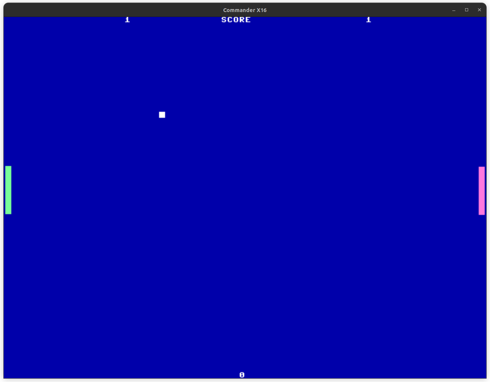
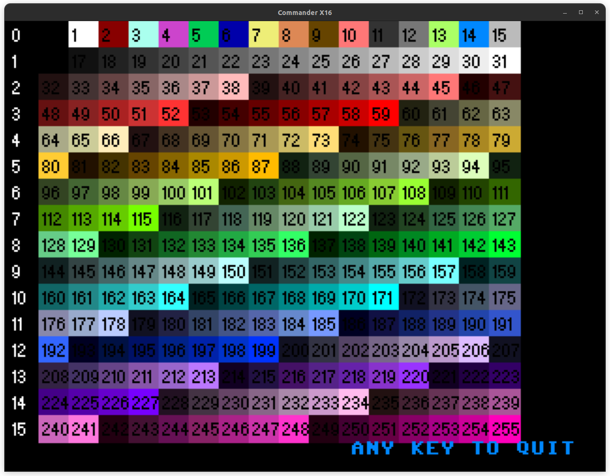
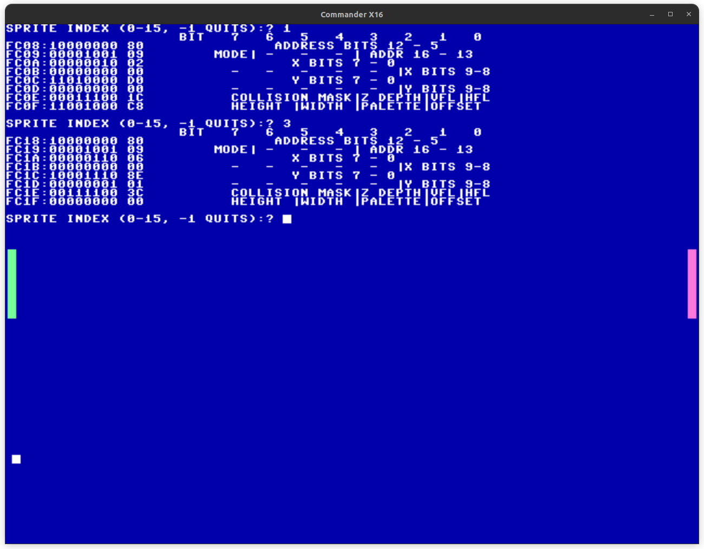
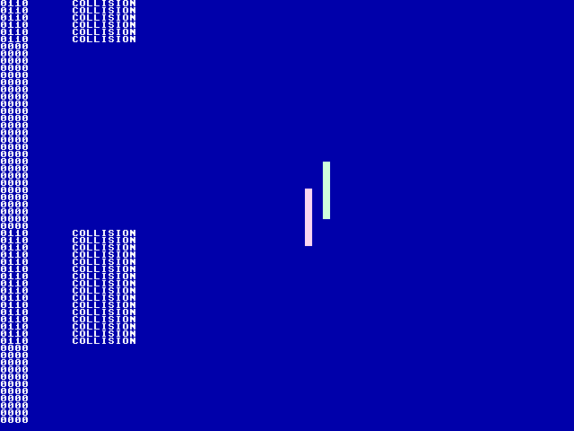

# Pong in Commander X16 Basic

Most of the following BASIC programs were written as text files and "compiled"
using [BASLOAD](https://cx16forum.com/forum/viewtopic.php?t=6322), a BASIC
tokenizer/compiler that runs on the Commander X16.  That said, they were all
written *on* the Commander X16, and only run in an emulator to produce
screenshots.  Working on the bare metal is nostalgic fun!

- [Pong in Commander X16 Basic](#pong-in-commander-x16-basic)
  - [The Game - PONG.BASL / .BAS](#the-game---pongbasl--bas)
  - [Development and Debugging Helper Programs](#development-and-debugging-helper-programs)
    - [PALETTE3.BAS](#palette3bas)
    - [SPRITEATTR.BASL / .BAS](#spriteattrbasl--bas)
    - [SPRTCOL.BASL / .BAS](#sprtcolbasl--bas)

## The Game - PONG.BASL / .BAS

```shell
x16emu -run -prg PONG.BAS
```

A very simple [Pong](https://en.wikipedia.org/wiki/Pong) clone, written entirely
in Commander X16 BASIC, taking advantage of sprite commands in BASIC, with a
minimal amount of memory `PEEK`ing and `POKE`ing to detect [sprite collisions](https://github.com/X16Community/x16-docs/blob/master/X16%20Reference%20-%2009%20-%20VERA%20Programmer's%20Reference.md#sprite-collisions).



## Development and Debugging Helper Programs

### PALETTE3.BAS

```shell
x16emu -run -prg PALETTE3.BAS
```

Displays the current palette, including color indexes and palette offset values
for sprites.



I originally wrote this using in BASIC, rather than as a text file for input to BASLOAD like the other programs in here, so the version-controlled file isn't text.  The source code follows.

```basic
10 SCREEN $80
20 SX=16:SY=14
30 RECT 0,0,319,239,0
40 C=0:PO=0
50 FOR Y=0 TO 219 STEP SY
55 CHAR 0,Y+10, 1, STR$(PO)
56 PO = PO + 1
60 FOR X=16 TO (16*SX) STEP SX
70 RECT X+2,Y, X+SX+2,Y+SY, C
80 CHAR X,Y+10, 0, STR$(C)
90 C=C+1
100 IF C=256 THEN 200
110 NEXT
120 NEXT
200 LOCATE 30,24
210 PRINT "ANY KEY TO QUIT"
220 GET K$: IF K$="" THEN 220
230 SCREEN $00
```

### SPRITEATTR.BASL / .BAS

```shell
x16emu -run -prg SPRITEATTR.BAS
```

Prints the attributes of a sprite, with memory addresses, binary, hexidecimal, and [reference description from the docs](https://github.com/X16Community/x16-docs/blob/master/X16%20Reference%20-%2009%20-%20VERA%20Programmer's%20Reference.md#sprite-attributes).

In the following screenshot, SPRITEATTR was run after PONG, and the left player paddle (1) and ball (3) sprite attributes are printed.



### SPRTCOL.BASL / .BAS

```shell
x16emu -run -prg SPRTCOL.BAS
```

The sprite collision feature of VERA was a little difficult for me to understand at first, so this is just an experiment to understand how...

  1. to configure sprites for collision detection,
  1. VERA behaves when collisions occur,
  1. collisions are detected and reported when no interrupt is set,
  1. the upper byte of the ISR register looks during collisions, and
  1. (and initially if) sprite collisions can be handled from BASIC alone.


