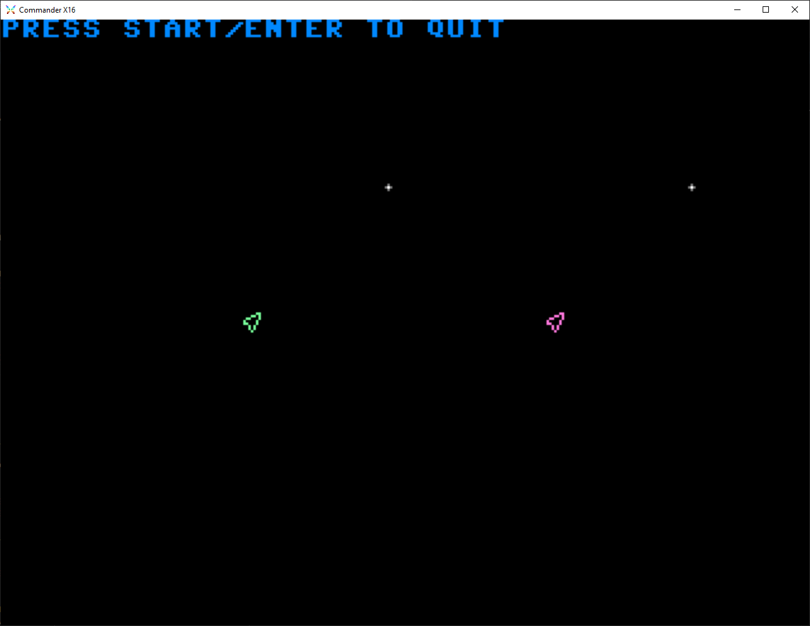

A (work-in-progress) game in the spirit of
[Spacewar!](https://en.wikipedia.org/wiki/Spacewar!), written in
[BASIC](https://github.com/X16Community/x16-docs/blob/master/X16%20Reference%20-%2004%20-%20BASIC.md),
for the [Commander X16](https://www.commanderx16.com/).  The purpose of this
project is to demonstrate the ability to write a simple, self-contained, two
player, arcade-style game in BASIC that is easy to understand and modify by
novice programmers.



## Running

`SPACEWAR.BAS` is `spacewar.basl` processed through the
[BASLOAD](https://github.com/stefan-b-jakobsson/basload) program.

On the emulator, start-up should look something like.

```
SEARCHING FOR BASLOAD.PRG
LOADING FROM $0801 TO $175D
READY.
RUN

*** BASLOAD 0.2.6 ***
...
READY.
!L

*** BASLOAD 0.2.6 ***

ENTER FILE NAME: SPACEWAR.BASL
LOADING...
READY.
RUN
```

On the developer board, with January 2024 SD card image, you'll start with the
following, but everything else should be the same.

```
LOAD"DEV/BASLOAD.PRG
```
